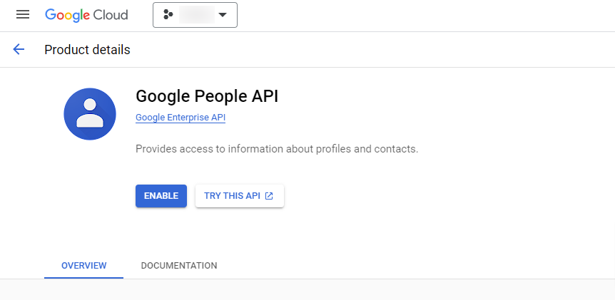

# Enable APIs on GCP

The APIs listed below are free to use.

## Gmail API

Navigate to this link:
https://console.cloud.google.com/marketplace/product/google/gmail.googleapis.com

Click to "ENABLE" button.

If the process was successful, you will see the following screen:

The Gmail API is enabled.

## People API (for contacts)

Navigate to this link:
https://console.cloud.google.com/marketplace/product/google/people.googleapis.com

Click to "ENABLE" button.

If the process was successful, you will see the following screen:

The People API is enabled.
