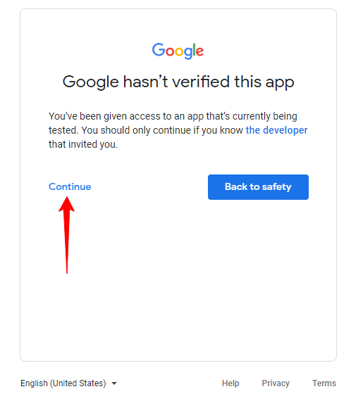
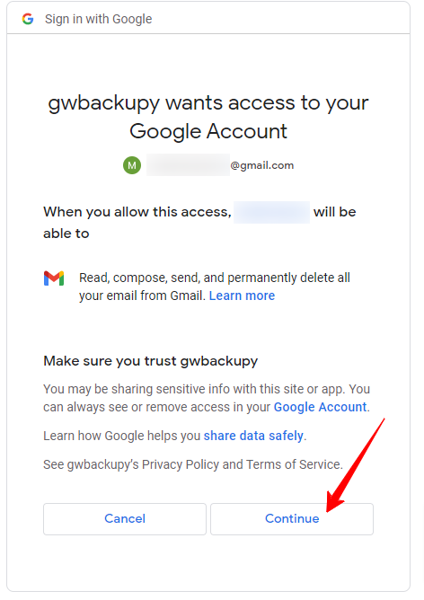

# OAUTH setup

This solution can be used for both gmail free and Google workspace paid plans.
*Not recommended for paid plans.*

## 1. Register to Google Cloud

If you do not have an account yet, here is the description: [Registering to GCP](register-to-gcp.md)

## 2. Create a GCP project if you don't already have one.

## 3. Enable API-s

You can enable the APIs for the services you want to use based on this description:
[Enable APIs on GCP](enable-gcp-apis.md)

## 4. Create a "OAuth content screen"

- In GCP console navigate to "APIs & Services" > "OAuth Content Screen"
- Please fill in the required information. If you are using it for your own purposes, 
there is no need to fill in all the information, as you will only be using it in test mode.

  "SAVE AND CONTINUE" button at the bottom of the page.
- Nothing needs to be filled in on the Scopes page.

  "SAVE AND CONTINUE" button at the bottom of the page.
- On the test user page, add the accounts for which you want to grant access.
  *Remember, you can only add accounts that originate from Gmail or Google Workspace.*

  "SAVE AND CONTINUE" button at the bottom of the page.
- At the bottom of the summary page, the Oauth screen is ready with the BACK TO DASHBOARD button.

On the OAuth Consent Screen, you will have the option to add additional test users in the future.

This description does not cover the publishing of the OAuth Consent Screen.

## 5. Create a credentials

- In gcp console navigate to "APIs & Services" > "Credentials"
- The "+ CREATE CREDENTIALS" button at the top of the page.
- In the select, choose "OAuth client ID".
- In "Application Type", choose "Desktop App".
- Specify the name of the application, e.g. "gwbackupy"
- Click to "CREATE" button
- In the pop-up window, click on the "DOWNLOAD JSON" button to download the credentials JSON file.
  
  **Handle the JSON file securely. Do not share it with anyone and do not make it available on the internet.**
- Copy the JSON file to a location where gwbackupy also has access and can specify its path as a startup parameter.

## 6. First run of gwbackupy

Run in CLI (terminal):
```bash
gwbackupy --credentials-filepath <file path of credentials JSON> gmail backup --email <email address of backup>
```

e.g.:

```bash
gwbackupy --credentials-filepath .tmp/gwbackupy-test-oauth-client_secret_368702422762-84sf6lcl949ipohkho8qtumceatudlre.apps.googleusercontent.com.json gmail backup --email gwbackupy.test@gmail.com
```

If the parameters are correct, you will receive the following lines. 

> Please visit this URL to authorize this application: https://accounts.google.com/o/oauth2/auth... 

If the system is able to, it will automatically start a browser with the link. 
*Please always check that the browser has started in the correct profile (in case of multiple profile usage).*

In the browser window, select the email account specified.

On the following page, click the "Continue" button. 
*You will only receive the security warning if the OAuth Consent Screen is being used in test mode or by a test account.*



On the next screen, click "Continue" again to allow the application full access to the gmail account.



If successful, you will receive the following message in the browser:

> The authentication flow has completed. You may close this window.

Meanwhile, gwbackupy has already started in the background and has begun saving the emails found in the account.

*This step is required for each account. Additionally, it may occur that the Google servers require 
it again due to infrequent use or other security considerations.*
