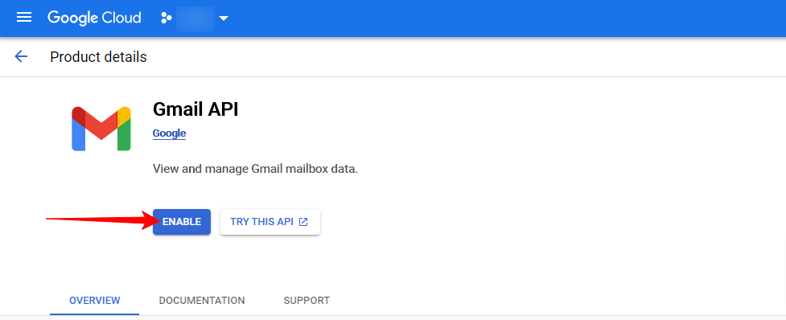
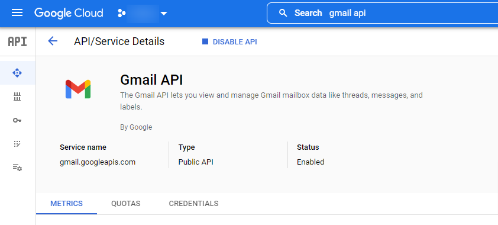

# Service Account Setup

## 1. Register to Google Cloud

https://cloud.google.com/

## 2. Create a service account

Login to [Google Cloud Console](https://console.cloud.google.com/)

## 3. Generate key file for service account

...

## 4. Enable API-s

...

## 4.a Enable Gmail API

https://console.cloud.google.com/marketplace/product/google/gmail.googleapis.com

...
