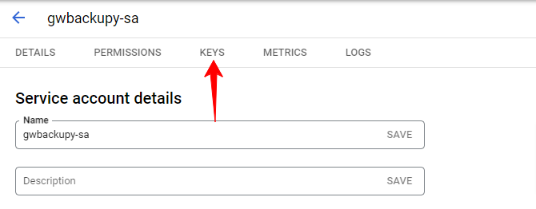

# Service Account Setup

**This solution can only be used for Google Workspace™ paid plans.**

## 1. Register to Google Cloud

If you do not have an account yet, here is the description: [Registering to GCP](register-to-gcp.md)

## 2. Create a GCP project if you don't already have one.

## 3. Enable API-s

You can enable the APIs for the services you want to use based on this description:
[Enable APIs on GCP](enable-gcp-apis.md)

## 4. Create a service account

- In GCP console navigate to "APIs & Services" > "Credentials"
- The "+ CREATE CREDENTIALS" button at the top of the page.
- In the select, choose "Service account".
- Fill the input fields and click the "CREATE AND CONTINUE" button.
  
- "Grant this service account access to the project', then click on the 'CONTINUE' button."
- "Grant users access to this service account", then click on the "DONE" button.

"The service account has been successfully created.

## 5. Creating and downloading a key file for the service account.

- In gcp console navigate to "APIs & Services" > "Credentials"
- In the "Service Accounts" section, click on the email address of the service account that you created.

  
- Click on the "KEYS" tab
  
- Click on the "ADD KEY" button and choose "Create new key".
- Key type JSON, click on the "CREATE" button.
- Save the key file in a location where gwbackupy has access to.

**Do not share the key file with anyone and do not make it accessible on the internet.**

You have successfully completed the steps. ű
All you have to do now is to provide the path of the key file as a parameter for gwbackupy.

## 6. Delegating the service account to all users in Google Workspace™. (Optional)

...
